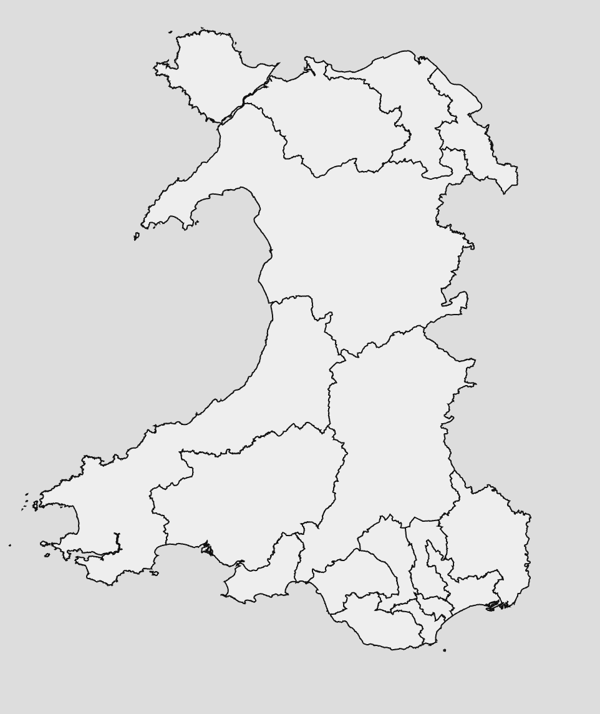
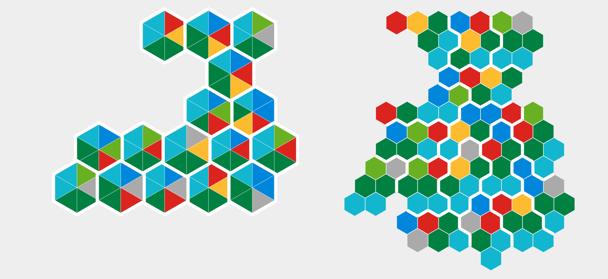

# 2026-workshop-week7-maps

## 2026 Wales Senedd Election
    
The 2026 Senedd election in Wales will be the first conducted under a new proportional representation system. Wales has been divided into 16 constituencies, each of which will elect 6 members to the Senedd, for a total of 96 seats. On these pages are some maps that attempt to deal with the problem of visualising election results under this system.

### Choropleth - geographic area map

`choro.html` contains a traditional geographic map showing the actual geographic boundaries of the constituencies. With traditional 'first past the post' election results each constituency would be coloured according to the single winner of that constituency. It is worth noting that as these constituencies vary significantly in geographic size, this can give a misleading impression of the distribution of support for different parties. With a proportional representation system there is a bigger challenge: how would we represent the results of a proportional representation system on this map?

**How might we represent the results of a proportional representation system on a traditional geographic map?**

**Is that the only way we could represent these results?**

**Can you implement any of these solutions?**

### Hexmap - fixed area map

`hex.html` contains two different implementations of hexmaps. The first uses a single hexagon to represent each constituency, with each Senedd member represented by a triangle covering 1/6 of the hexagon. The second uses 6 hexagons to represent each constituency, with one MS per hexagon.

Hexmaps are useful for representing election results as each hexagon (or triangle) can represent one member, making it easy to see how many members each party has won in each area. However, as the hexagons are not in their true geographic locations, this can make it harder to see the overall geographic distribution of support for different parties, and in a proportional representation system it may be harder to get an overall sense of the results at a high level.

The implementation here is not complete - though the data is loaded from the results spreadsheet the results spreadsheet itself is incomplete, and the code to actually colour in the regions of the map has not been implemented.

**Create some 'fake' election results for the 96 seats of the new Senedd, by taking the current proportions of the different parties in the Senedd and extrapolating out to the larger Senedd. Make sure party details are included so you can use these later. `senedd_results.csv`**

**Find the correct colours for each of the political parties in the Senedd.**

**Implement the code to give each portion of the map the correct fill colour so that the map looks something like the example above (line 94 of `hex.html`)**